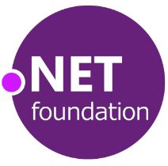
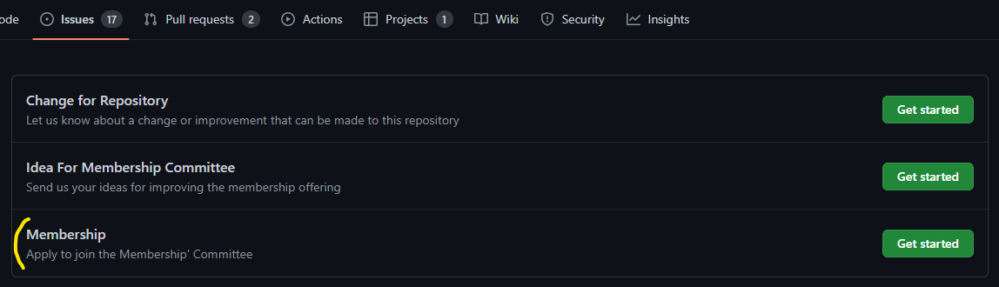

  

# The .NET Foundation Membership Committee

The committee is responsible for evaluating new member applications and discussing membership criteria. [See more information about .NET Foundation committees here](https://dotnetfoundation.org/community/committees).

## Details

**Chairperson(s):** Chris Woodruff

**Meets:** 1st Wednesday of each month at 3:00pm ET (8:00 pm UTC during winter / 7:00pm UTC otherwise)

**Repository:** https://github.com/dotnet-foundation/wg-membership

## Governance

Meeting notes up to early 2024 are available [here](meetings). Meetings are now conducted via Discord.

This committee seeks to have a diverse set of representatives from various stakeholders. At the same time, we try to keep the committee somewhat small so that we can have productive meetings. But in order to satisfy the desire for open participation from everyone – and in the sake of transparency – we made this repo public, which includes notes and proposals that documents the progress of the committee. If you have any questions, please open a discussion.

## Contributing

Please refer to our [Contributing file](./.github/CONTRIBUTING.md)

## Joining And Attending Membership Meetings

- [Create an issue](https://github.com/dotnet-foundation/wg-membership/issues/new/choose) using the "Membership" issue template
- On seeing this Chris Woodruff will accept the issue and close it, then send you the next meetings invite.

  

## Current Membership

**Chair:**  Chris Woodruff

**Scribe(s)** Angela Cruz

**Members**
- [Chris Woodruff](https://github.com/cwoodruff)
- [Aneesh Gopalakrishnan](https://github.com/codehippie1)
- [Ove Bastiansen](https://github.com/ovebastiansen)
- [Isaiah Clifford Opoku](https://github.com/Clifftech123)

## Code Of Conduct

[See the Code of Conduct here](CODE_OF_CONDUCT.md).