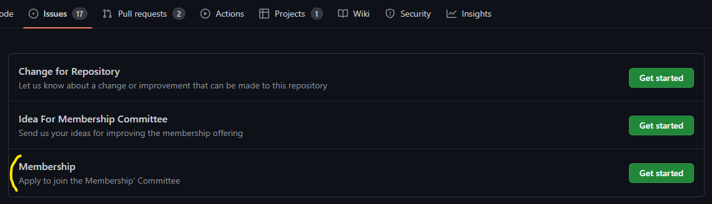

  

# Membership Commitee Charter

## Mission Statement

To manage and improve the membership offering of the .NET Foundation.

## Membership

The option to take part and be involved in the membership committee is open to all members of the .NET Foundation. 

We ask that you have a GitHub profile set up, as our organisation and tooling is all based in this GitHub repository. 

### How To Join The Membership Committee

- [Create an issue](https://github.com/dotnet-foundation/wg-membership/issues/new/choose) using the "Membership" issue template

  

- On seeing this [Jessica White](https://github.com/wordshaker) will accept the issue and close it, then send you the next meetings invite.
- After attending two meetings, you will be added to the CODEOWNERS of this repository and be added to the committee GitHub Teams.

### Expected Level of Contribution

To remain a member of the committee we ask that you attempt to attend meetings at least once a month. If you are unable to attend at this frequency or have to miss a couple for extenuating circumstances, you will be expected to raise this with the committee. You won't need to provide specifics, it's to let the group know you intend to take part in future.

If you cannot attend at that frequency, you could also contribute by submitting issues or pull requests to the repository.

Each committee meeting will have a draft agenda in GitHub available before the meeting. This is how to check when issues you are passionate about are going to be up for discussion and action votes.

## Termination of Committee Membership

On a quarterly basis, the chair, scribe or appointed representative will review levels of contribution from [members of the membership GitHub Teams](https://github.com/orgs/dotnet-foundation/teams/membership/members). If the expected contribution levels have not been met, without you talking to the committee about the reasoning for the decline in your contributions you will be contacted via email. If you have not responded within 30 days of attempted contact, your membership to this team will be revoked.

After termination, you can re-apply to join the committee if you so wish.

## Chairperson

The Chairperson of the committee is an elected member of the Board of Directors. They will have volunteered to be the chair and spokesperson of the committee.

The current Chairperson of the membership committee is [Jessica White](mailto:Jessica.White@dotnetfoundation.org)

## Standard Committee Procedures

The committee meets on the 1st and 3rd Wednesday of each month at 7:00pm UTC. The meetings are faciliated by the chairperson or a volunteer if the chairperson is not available to attend.

Meetings have an agenda which is shared on GitHub and can be contributed to by any committee member. Each agenda item will have a GitHub Issue assigned which provides more context to the discussion point. 

Minutes of each meeting are recorded, and can be viewed [here](../../meetings/).

### Decisions and disputes
Decisions are made via vote. If the committee cannot come to agreement on an action, it will be postponed or the chairperson will discuss with other board members to determine which decision would be in the best interests of the foundation.

### Feedback to the board
The Chairperson will feedback to the other members of the Board of Directors on a monthly basis. This includes topics that are currently in discussion, actions being taken and measures of success.

## Duties, and Responsibilities

The committee meets on the 1st and 3rd Wednesday of each month at 7:00pm UTC. This time will be revisited once a year or as the makeup changes and different times work better in different time zones.

Meetings have an agenda which is shared on GitHub and can be contributed to by any committee member. Each agenda item will have a GitHub Issue assigned which provides more context to the discussion point. 

Minutes of each meeting are recorded, and can be viewed [here](../../meetings/).

### Responsibilities

The committee is responsible for:
* evaluating new member applications
* discussing membership criteria
* improving the membership value and offering
* discussing how to build a great community and make membership appealing to more groups
* managing the nomination and election process

### Duties

**Duty of care** :
Exercise reasonable care when making decisions relating to the committee and the .NET Foundation.

**Duty of loyalty** :
Act in the best interests of the committee and the .NET Foundation

**Duty of obedience​​**:
Act in a way that is consistent with the goals of the committee and the .NET Foundation.

---

_Last Reviewed:_

_Last Approved:_