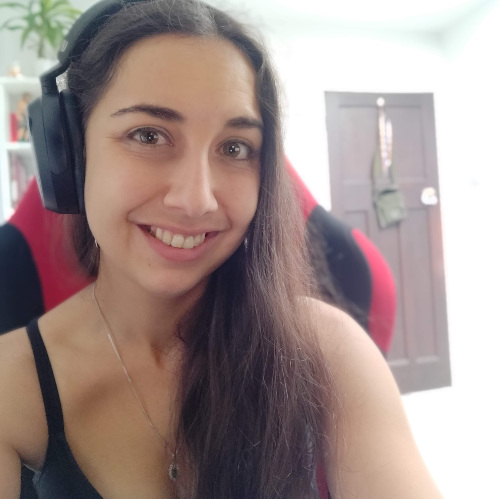

# [Membership](https://github.com/dotnet-foundation/wg-membership#readme)

The committee is responsible for:
* evaluating new member applications
* discussing membership criteria
* improving the membership value and offering
* discussing how to build a great community and make membership appealing to more groups
* managing the nomination and election process

Head to the repository for more information about how to join and get involved.

## Details

**Meets:** 1st and 3rd Wednesday of each month at 7:00pm UTC

**Repository:**  https://github.com/dotnet-foundation/wg-membership

## Chairperson(s)

**Name:** Jessica White

**Email:** jessica.white@dotnetfoundation.org

  

