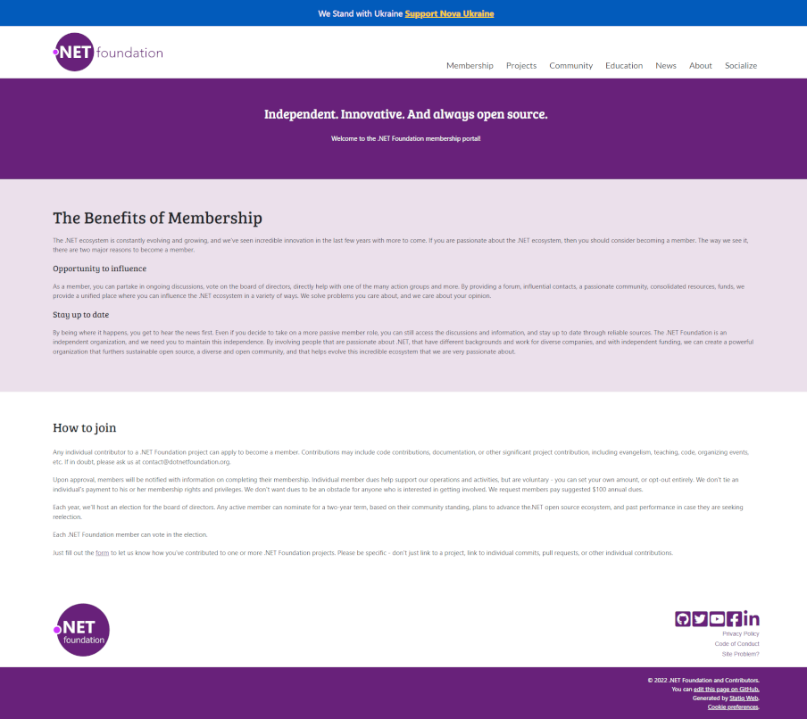
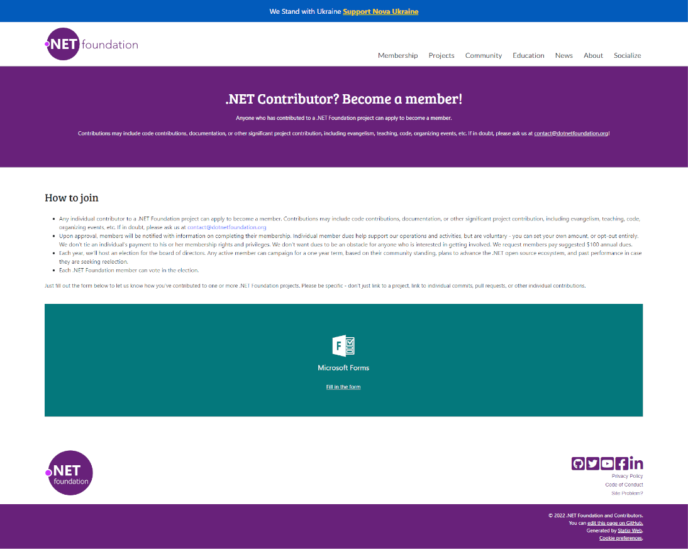

  

# Membership Web Pages

Each of the committee's have their own pages relating to the commitee's and their causes. The membership page has a sub-page of `become-a-member` which contains the details of how someone can get membership to the .NET Foundation.

---

## Root Page (Member)

### Link 
[https://dotnetfoundation.org/member](https://dotnetfoundation.org/member)

### About

This is the page landed on when people select `Membership` on the navigation. The intention is to share about both the membership and the membership committee. 

### Screenshot

  

---

## Become A Member Page

### Link
[https://dotnetfoundation.org/member/become-a-member](https://dotnetfoundation.org/member/become-a-member)

### About

This sub-page is currently reached via a link on the main page. It instructs those who land on it, how to sign up to become a member of the .NET Foundation.

### Screenshot

  

